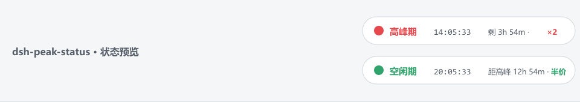

# dsh-peak-indicator

English | [中文](README.zh-CN.md)

A peak-hour indicator for the [DeepSeek Harness](https://github.com/deepseek-ai/deepseek-harness) web GUI. A small native chip in the session header shows whether the current **Beijing time** falls inside DeepSeek's API **peak window**, with a live clock, a countdown to the next transition, and a pricing hint.



## What it shows

DeepSeek's official peak/valley API pricing took effect on **2026-08-17**:

| State | Beijing time (daily) | Price |
| :-- | :-- | :-- |
| 🔴 **高峰 / peak** | 09:00–12:00 and 14:00–18:00 | peak price (= off-peak ×2) |
| 🟢 **空闲 / off-peak** | everything else | half of peak |

The chip (top-right of the conversation header, inside the native `conversation.session.header.utilities` strip) renders:

- a colored status dot — **red = peak, green = off-peak**
- the live Beijing clock (`HH:MM:SS`, timezone `Asia/Shanghai`, independent of the machine's timezone)
- a countdown: `剩 3h 54m · 价格 ×2` (peak) / `距高峰 3h 54m · 半价` (off-peak)
- click to expand a small popover with the full detail: peak windows, next transition with `HH:MM:SS` countdown, a phase progress bar, and the pricing note

Everything is themed with the web UI's native `--dsw-alias-*` variables, so it blends into the interface — no floating overlays.

## Install

The plugin is a real package mounted through the profile's patch layer, so it **survives dsh web restarts**.

### Via the dsh CLI (after publishing to npm)

```sh
dsh plugin --profile web add dsh-peak-indicator
```

### Manual / from source

1. Copy (or link) the `dsh-peak-indicator` folder into the profile's `node_modules`:

   ```sh
   # from the repo root
   cp -R . "$HOME/.dsh/profiles/web/node_modules/dsh-peak-indicator"
   ```

2. Add one insert to `~/.dsh/profiles/web/cordis.patch.yml`:

   ```yaml
   - insert:
       - id: dsh-peak-indicator
         name: 'dsh-peak-indicator'
   ```

3. Refresh the page (the patch file is watched and hot-reloads); restart `dsh web` if the chip does not appear.

## Build

The shipped `lib/` is generated from `src/`:

```sh
npm run build     # copies src/*.js -> lib/
npm run check     # syntax-check both halves
npm test          # boundary tests for the peak algorithm
```

`npm publish` runs `prepack` (build) automatically.

## Peak window policy

The peak windows are hard-coded in `src/client.js` (`BOUNDS = [540, 720, 840, 1080]` — 09:00, 12:00, 14:00, 18:00 in minutes of day). If DeepSeek ever changes the schedule, update that one constant and rebuild. Open an issue or PR in this repository and the community plugin list ([awesome-dsh-plugin](https://awesome-dsh-plugin.com)) will pick it up.

## Repository layout

```
dsh-peak-indicator/
├── src/             # source of truth (host half + browser half)
├── lib/             # built output, committed for zero-friction installs
├── scripts/         # build + tests
├── cordis.patch.yml # bundle patch used by `dsh plugin add`
└── package.json     # dsh.bundle / dsh.client declarations
```

## Publish

```sh
npm publish          # prepack builds lib/ automatically
```

Then `dsh plugin --profile web add dsh-peak-indicator` installs the published version.

## License

[MIT](LICENSE)
